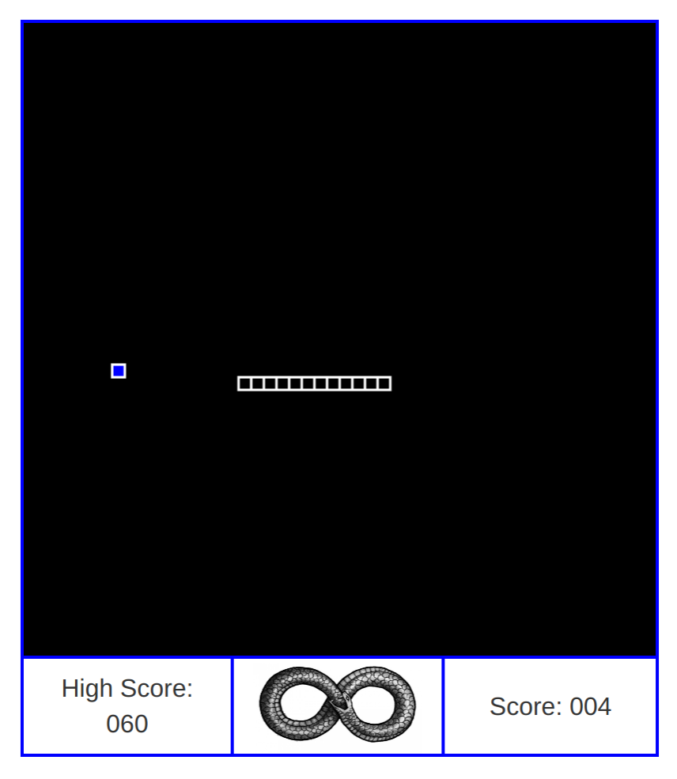

# ***Snake!***

*JavaScript exercise, April 2017*

**By Joshua Fairchild**

---

## Description
This is game "snake", recreated using HTML, CSS and JavaScript. I created this project to practice using JavaScript to interact wth the HTML canvas element, and to practice using object oriented techniques when working with the canvas element.

---

#### Basic Specifications
| Behavior | Example Input | Example Output |
|----------|---------------|----------------|
| Snake moves independently | *user loads the game* | *snake moves 10px in the current direction (every 55 ms)* |
| "Foodsquare" spawns randomly | *user loads the game / snake consumes a foodsquare* | *new foodsquare spawns at a random location* |
| Snake can change direction | *user presses an arrow key* | *snake begins moving in the specified direction* |
| Snake grows in size | *user moves the "head" of the snake over a foodsquare* | *foodsquare disappears, snake grows by one unit* |
| Game ends when the snake touches itself or a wall | *user moves the "head" of the snake onto another square of the body, or into the border* | *game resets (page reload)* |
| Score is recorded | *snake consumes a foodsquare* | "Score: *X*" *displayed to user*  |
| High scores are recorded | *game ends with a score higher than any previous scores made locally on this browser* | "Score: *X*" *displayed to user* |

----

#### Setup/Installation
* Clone this repository

 `git clone https://github.com/joshuafairchild1/snake`

* Navigate to "index.html" within the root directory and open it with any modern web browser

* The webpage can also be viewed [here](https://joshuafairchild1.github.io/snake/)

* **A keyboard with functional left/right/up/down arrow keys is required to play the game**

#### Known Bugs/Issues
* None currently

#### Technologies Used
* HTML (Specifically the canvas element)
* CSS with Bootstrap
* JavaScript with jQuery

#### Legal

This software is licensed under the MIT license

Copyright (c) 2017 Joshua Fairchild
